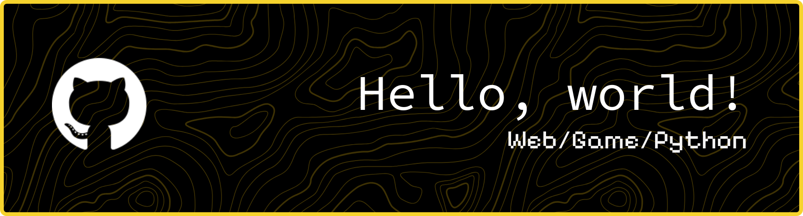

# Hello, World!

.png)

### My name is Jesslyn, A.K.A Skythe / Levitate
### I am a..
- **Web Developer 🌐**
- **Game Developer 🎮**
- **Linux Enthusiast 🐧**
- **Python Programmer 🐍**
- **Highschool Student 📖**

## I can do..

## Tools that I used

## My profiles

